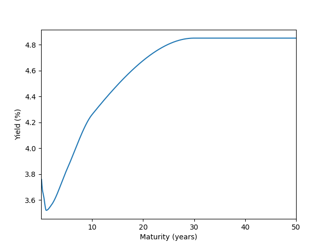

# Market Data Server (Government Bond Yield Curves)

## Overview
The purpose of this program is to implement a simple market data service that ingests government bond yields for constant maturities and estimates yields of arbitrary maturity via interpolation. The service supports both US and UK bonds and can query both the latest date or a time series for a given date range. The resulting yield curves are finally exposed in JSON format via a REST API over HTTP.

## How to Run
This program was developed using Python version 3.12 but only requires the following libraries:
- NumPy 
- SciPy (only uses interpolate package)
- pandas
- Requests
- Flask

In order to run the program, the user needs to first run `fetch.py` once and then run `server.py`. Then make requests to http://127.0.0.1:5000 at the desired endpoint.

## Example API Calls
Here are some example URLs that can be opened directly in a web browser once the server is running.

- http://127.0.0.1:5000/latest?country=US&maturity=1.5
- http://127.0.0.1:5000/latest?country=UK&maturity=8
- http://127.0.0.1:5000/timeseries?country=US&maturity=4&start=2025-06-01&end=2026-01-01
- http://127.0.0.1:5000/timeseries?country=UK&maturity=17&start=2025&end=2026

Alternatively, it can be accessed through curl using, for example: 
```powershell
curl "http://127.0.0.1:5000/latest?country=US&maturity=2.5"
```

## Data Sources
Data is pulled by `fetch.py` by making requests to the FRED service on the [St. Louis Fed website](https://fred.stlouisfed.org) and the IADB service on the [Bank of England website](https://www.bankofengland.co.uk/). 

It pulls the following data series IDs from FRED: `DGS1MO`, `DGS3MO`, `DGS6MO`, `DGS1`, `DGS2`, `DGS5`, `DGS10`, and `DGS30` and the following data series IDs from IADB: `IUDSNPY`, `IUDMNPY`, and `IUDLNPY`.

## Design & Implementation Choices
I chose to use the Python Requests package to pull data from the website rather than through official client library (e.g. pyfredapi). Both US and UK data was available in downloadable CSV format. For the purpose of this project, I chose to only download data from 01 Jan 2024 and onwards. 

The program stores this data in a pandas dataframe where it is then cleaned and transformed into a time series storing date, country, instrument, maturity, and yield to simplify interpolation. Missing data (weekends missing as well as some empty yields in FRED data) is removed.

The first program, `fetch.py` stores the complete data in a single file named `all_df.csv` which is read once by the server at startup, from which all curves are constructed on demand per request.

The program implements a piecewise cubic Hermite interpolation of yields. This produces a smooth curve and avoids oscillation frequently exhibited by other polynomial interpolation methods. 

For extrapolation outside of the data range, it is simply flat outside the given data, otherwise we would get odd and inaccurate results. While the API does not explicitly prevent the user to query yields for very short, very long, and even negative maturities, they will simply return the same yield as the shortest or longest maturity available.

Flask exposes the data on a locally-run server that outputs it as a JSON in one of two ways: 
- At `/latest`, where it returns the yield for the latest available date.
- At `/timeseries`, where it returns a time series containing the yields for all dates between a given start and end date.   

These can be accessed at [127.0.0.1:5000/latest](127.0.0.1:5000/latest) or at [127.0.0.1:5000/timeseries](127.0.0.1:5000/timeseries) with the correct URL parameters.

Users should specify the following parameters in their queries/requests to the server.

**For `/latest`:**
- country (US or UK)
- maturity (measured in years, a float value)

**For `/timeseries`:**
- country (US or UK)
- maturity (measured in years, a float value)
- start (start date)
- end (end date)

The start and end parameters should be in any format accepted by the pandas `to_datetime` method, typically a string like "2026-01-28" or "28 Jan 2026".

If an erroneous start or end is passed, it will default to 1 Jan 2024 or the present time respectively. The program does not assume a "default" maturity or country since these are considered essential parts of the query. An erroneous maturity or country will return a HTTP error 400 (corresponding to a bad request). 

Finally, output dates in the JSON are given in the preferred date representation for the current locale, without the time. This corresponds to my choice of output using `.strftime("%x")` rather than having it in ISO yyyy-mm-dd.

Though yield data is pulled and stored as a percentage, the API returns **decimal yields**. A yield output of 0.0352 means 3.52% yield. Yields are never rounded or truncated.


## Example Yield Curve
The plot below was generated during production depicting an example yield curve for US Treasures on 28 Jan 2026. This figure is provided for illustrative purposes only; the API itself returns only the data in JSON format and does not generate plots.



The following code can be attached to `fetch.py` to generate such plots by the user:

```py
import matplotlib.pyplot as plt
f = build_curve("US", "28-Jan-2026")
x = np.linspace(0,50,1200)
y = [f(i) for i in x]
plt.xlim(1/365,50)
plt.xscale('log')
plt.xlabel("Maturity (years)")
plt.ylabel("Yield (%)")
plt.plot(x,y)
```
## Future Improvements
There are a few possible improvements that I would have liked to implement had I more time to work on the project. 
#### UK data
Firstly, the small amount of UK data makes the results seem unimpressive. Especially without intelligent extrapolation, this means the range of sensible queries for UK gilt yields are only between 5 and 20 years, though it is entirely reasonable for someone to expect yields for shorter maturities. 

#### Extrapolation
Currently, extrapolation is done relatively lazily by truncating to the closest date. Given more time and investigation I would have liked to modelled extrapolation slightly more intelligently so as to allow for better speculation on yields outside the supplied data. 

#### Choice of interpolation
I did not have enough time or knowhow during the project to implement the Nelson-Siegel method of interpolation, which is theoretically supposed to be better-behaved for longer maturities. After the project I became aware of pre-existing Nelson-Siegel packages on Python which would have saved time, but I also did not want to ship a product that I did not know the technical maths and relevant theory behind.

#### User friendliness
Currently, the easiest way to interface with the server is to run the files, open a browser, and make requests to the server from there with carefully typed URL parameters. It would be better if the parameters could be handled in a nicer way.

There is also no good visualisation for the yield curves, so it is unintuitive for someone who wants to see either how yields change over different maturity lengths (in /latest) or how yields change over time for a fixed maturity (in /timeseries). As a matter of fact, there is no way to compare yields for different maturities side-by-side at all!

During the creation of the program, I used Matplotlib to generate me a few plots of the yield curves as sanity-checks, and I was slightly displeased that the finished product could not also include these plots.

## Acknowledgements
This project was developed as part of a coding challenge for Actrix FT.
